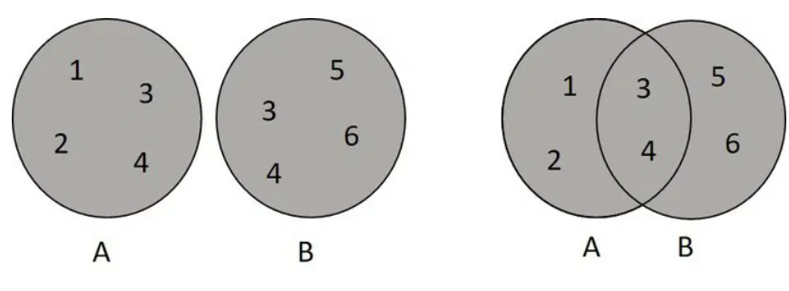
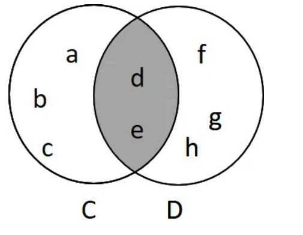
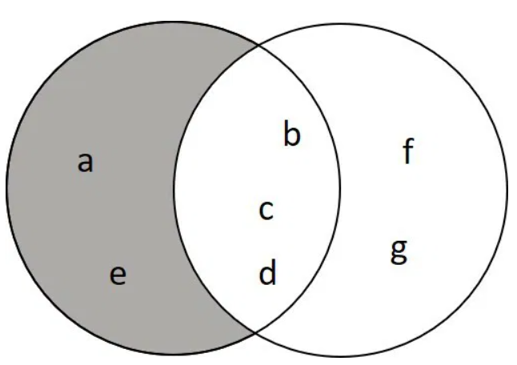

```{r setup, include=FALSE}
knitr::opts_chunk$set(echo = TRUE)
```
--- 

# Objetivo

Vamos explorar a teoria de conjuntos, seus exemplos e aplicações. No relatório, abordaremos os seguintes tópicos:

1.Experimento aleatório

2.Teoria de conjuntos

3.Espaço amostral

4.Evento

5.Operações com conjuntos

6.Probabilidade

7.Conclusão

8. Teorema de Bayes

# Teoria de conjuntos


## Experimento Aleatório

EXEMPLO: Lançar um dado de seis faces.

Resultados Possíveis (Evento Aleatório): Os resultados associados ao lançamento podem ser uma das faces: 1, 2, 3, 4, 5 ou 6.


Cada vez que o dado é lançado, o resultado é imprevisível, podendo resultar em qualquer um dos seis números.


## População ou conjunto

População: é uma coleção completa de todos os elementos (valores, pessoas, medidas, etc) a serem estudados. Como exemplos podemos citar:

• população de pacientes em um hospital especializado;


• população de turistas que visitam uma cidade específica;


• população de idades em anos dos residentes de um condomínio;


• população de produtos vendidos em uma loja de eletrônicos, entre outros.


Conjunto: por outro lado, é um termo mais amplo que pode se referir a qualquer coleção de elementos, que pode ou não ser uma população. Em estatística, pode se referir a um subconjunto da população, como uma amostra, que é um grupo selecionado para representar a população maior.Como exemplos podemos citar:


1.Conjunto de números pares: {2, 4, 6, 8, 10, ...}

2.Conjunto das cores do arco-íris: {vermelho, laranja, amarelo, verde, azul, anil, violeta}

3.Conjunto de alunos de uma turma: {Ana, Bruno, Carlos, Daniela}

4.Conjunto de frutas: {maçã, banana, laranja, uva}

5.Conjunto de cidades do Brasil: {São Paulo, Rio de Janeiro, Brasília, Salvador}

6.Conjunto de letras do alfabeto: {A, B, C, D, ..., Z}

7.Conjunto de planetas do sistema solar: {Mercúrio, Vênus, Terra, Marte, Júpiter, Saturno, Urano, Netuno}


## Espaço Amostral

O espaço amostral em estatística é o conjunto de todos os resultados possíveis de um experimento aleatório. Cada elemento desse espaço representa um resultado que pode ocorrer quando o experimento é realizado.


Exemplos de Espaço Amostral:


    Jogar um dado e observar o número da face de cima.
    Então; S = {1, 2, 3, 4, 5, 6}

    Jogar duas moedas e observar o resultado.
    Então: S = {(cara, cara), (cara, coroa),(coroa, cara),(coroa, coroa)}
    
    

## Evento

É um conjunto de resultados do experimento, em termos de conjuntos, é um subconjunto S. em particular, S e Φ (conjunto vazio) são eventos. S é dito o evento certo e Φ o evento impossível.

Se usarmos as operações com conjuntos, podemos formar novos eventos:

a) A ∩ B → evento que ocorre se A e B ocorrem;
b) A ∪ B → evento que ocorre se A ou B ocorrem;
c) Ā → é o evento que ocorre se A não ocorre.


Exemplo: 

    Jogar duas moedas e observar os resultados:
    S = {(c, c), (c, k), (k, c), (k, k)}

    Evento A: ocorrer faces iguais.
    Logo A = {(c, c), (k, k)}

## Operações com conjuntos

### Representação de Conjuntos na Forma Tabular

A representação tabular de conjuntos emprega os símbolos de chaves { } para delinear os elementos que os compõem, os quais devem ser separados por vírgulas.

Exemplos:

      A = {1, 3, 9, 12, 17} 

      B = {João, Luíza,Fernando,Lívia}
      
      
### Representação de Conjuntos por Propriedades

Um conjunto pode ser delineado por uma regra que especifica uma característica comum que seus elementos compartilham.

Exemplos:

      C = {x/x é um número primo} lemos: “O conjunto C é composto pelos elementos  x, de modo que x é um número primo.”

      D = {x / x é um número real positivo} lemos: “O conjunto D é formado pelos elementos x , tal que x pertence ao conjunto dos números reais e é um número real positivo.”

### Relação de Pertinência

A relação de pertinência constitui um conceito fundamental na Teoria dos Conjuntos.

Ela estabelece a condição de que um elemento seja considerado como integrante (ou pertença) ou não integrante (ou não pertença) de um conjunto específico. Por exemplo:

\( E = \{a, b, c, d\} \)

Assim, temos:

\( a \in E \) (ou seja, \( a \) pertence ao conjunto \( E \))

\( e \notin E \) (ou seja, \( e \) não pertence ao conjunto \( E \))

Isso implica que a relação de pertinência é uma interação definidora entre elementos e conjuntos.


### Relação de Inclusão

A relação de inclusão estabelece se um conjunto está contido (designado por \( \subseteq \)), não está contido (denotado por \( \nsubseteq \)) ou se um conjunto abrange (representado por \( \supseteq \)) algum subconjunto.

Exemplo:

 Seja 

 \( X = \{a, e, i, o, u\} \)  
 \( Y = \{a, e, i, o, u, m, n\} \)  
 \( Z = \{p, q, r, s, t\} \)

 Assim, podemos afirmar:

\( X \subseteq Y \) (isto é, \( X \) está contido em \( Y \), ou seja, todos os elementos de \( X \) são também elementos de \( Y \)).  

\( Z \nsubseteq Y \) (significa que \( Z \) não está contido em \( Y \), pois os elementos de \( Z \) não pertencem a \( Y \)).  

\( Y \supseteq X \) (indica que \( Y \) contém \( X \), visto que todos os elementos de \( X \) estão presentes em \( Y \)).  


### Conjunto Vazio

O conjunto vazio é o conjunto em que não há elementos; é representado por duas chaves { } ou pelo símbolo Ø. Note que o conjunto vazio está contido (C) em todos os conjuntos.


### União de conjuntos
A união, representada pela letra (U), corresponde a junção dos elementos de dois ou mais conjuntos, sem repetir elementos comuns.

Exemplo

A = {1, 2, 3, 4}
B = {3, 4, 5, 6}

Logo,

A U B = {1, 2, 3, 4, 5, 6}

Repare que os algarismos 3 e 4 foram representados uma única vez, mesmo estando presentes em A e B.




### Intersecção de conjuntos
A intersecção, representada pelo símbolo (∩), corresponde aos elementos em comum de dois ou mais conjuntos.

Assim, a intersecção é um novo conjunto, formado apenas pelos elementos que se repetem nos conjuntos iniciais.

Exemplo

C = {a, b, c, d, e}
D = {d, e, f, g, h}

Logo,

C ∩ D = {d, e}

Ao utilizar diagramas de Venn, a intersecção é representada pintando apenas a área onde os conjuntos estejam sobrepostos.

Essa área “guarda” apenas os elementos repetidos.



### Diferença de conjuntos
A diferença corresponde ao conjunto de elementos que estão no primeiro conjunto, e não aparecem no segundo,

Exemplo

A = {a, b, c, d, e} - B = {b, c, d, f, g}

Logo,

A - B = {a, e}

Veja que a operação retirou os elementos comuns que existem em B.

Na forma de diagrama, representamos como:



# Probabilidade


## Fórmula da Probabilidade

Em um fenômeno aleatório, as diversas possibilidades de ocorrência de um evento são igualmente prováveis.

Assim, podemos calcular a probabilidade de um resultado específico mediante a divisão entre o número de eventos favoráveis e o número total de resultados possíveis:

\[
P(A) = \frac{n(A)}{n(\Omega)}
\]

onde:

- \( P(A) \): representa a probabilidade da ocorrência do evento \( A \).
- \( n(A) \): denota o número de casos favoráveis, ou seja, aqueles que são relevantes ao evento \( A \).
- \( n(\Omega) \): refere-se ao número total de casos possíveis no espaço amostral \( \Omega \).

## Exemplos:


Exemplo 1:

Considerando o lançamento de um dado perfeito, qual é a probabilidade de que o resultado seja um número inferior a 3?

Resolução:

Dado que o dado é perfeito, todas as suas 6 faces possuem igual probabilidade de ficar voltadas para cima. Para determinar a probabilidade, aplicaremos a fórmula da probabilidade.

Neste contexto, devemos reconhecer que existem 6 casos possíveis (1, 2, 3, 4, 5, 6) e que o evento "obter um número menor que 3" apresenta 2 possibilidades, que são os números 1 e 2. Assim, podemos expressar:

\[
P(A) = \frac{n(A)}{n(\Omega)}
\]

Portanto, temos:

\[
P(A) = \frac{2}{6} = \frac{1}{3} \approx 0,33
\]

Para expressar essa probabilidade em termos percentuais, basta multiplicar o resultado por 100:

\[
P(A) \approx 0,33 \times 100 \approx 33\%
\]

Dessa forma, a probabilidade de que o resultado do lançamento do dado seja um número inferior a 3 é de 33%.


Exemplo 2

O conjunto de cartas, conhecido como baralho, compõe-se de 52 unidades, distribuídas em quatro naipes: copas, paus, ouros e espadas, sendo cada naipe constituído por 13 cartas. Assim, ao extrair uma carta aleatoriamente, qual é a probabilidade de que a carta retirada pertença ao naipe de paus?

Solução

Ao efetuar a extração de uma carta aleatoriamente, a incerteza impede qualquer previsão sobre qual carta será escolhida, configurando assim um experimento aleatório.

Nesse contexto, contamos com 13 cartas de paus, que correspondem ao total de casos favoráveis.

Aplicando esses valores na fórmula de probabilidade, obtemos:

\[
P(A) = \frac{n(A)}{n(\Omega)}
\]

Portanto,

\[
P(A) = \frac{13}{52} \quad \Rightarrow \quad P(A) = 0,25
\]

Consequentemente, ao multiplicar o resultado por 100, obtemos:

\[
P(A) = 0,25 \times 100 = 25\%
\]

Assim, a probabilidade de extrair uma carta do naipe de paus é de 25%.


# Teorema de Bayes

A probabilidade de Bayes nos ajuda a atualizar nossa crença sobre a ocorrência de um evento com base em novas evidências. A fórmula de Bayes é:

\[
P(A|B) = \frac{P(B|A) \cdot P(A)}{P(B)}
\]

Aqui, \( P(A|B) \) é a probabilidade de \( A \) acontecer dado que \( B \) ocorreu. Vamos ver alguns exemplos:

### Exemplo 1: Teste de doença
Um teste para uma doença tem uma precisão de 99%, ou seja, a probabilidade de que uma pessoa com a doença receba um teste positivo é 99%. Entretanto, apenas 1% da população tem essa doença.

- \( P(Doença) = 0.01 \) (A probabilidade de uma pessoa ter a doença)
- \( P(Positivo|Doença) = 0.99 \) (A precisão do teste)
- \( P(Positivo|Sem Doença) = 0.05 \) (A probabilidade de um falso positivo)

Agora, imagine que você recebe um teste positivo. Qual a probabilidade de você realmente ter a doença (\( P(Doença|Positivo) \))?

Usamos a fórmula de Bayes para calcular:

\[
P(Doença|Positivo) = \frac{P(Positivo|Doença) \cdot P(Doença)}{P(Positivo)}
\]

Onde \( P(Positivo) \) é a probabilidade total de um teste positivo, o que inclui tanto verdadeiros positivos quanto falsos positivos:

\[
P(Positivo) = P(Positivo|Doença) \cdot P(Doença) + P(Positivo|Sem Doença) \cdot P(Sem Doença)
\]

Substituindo os valores:

\[
P(Positivo) = (0.99 \times 0.01) + (0.05 \times 0.99) = 0.0099 + 0.0495 = 0.0594
\]

Agora podemos calcular \( P(Doença|Positivo) \):

\[
P(Doença|Positivo) = \frac{0.99 \times 0.01}{0.0594} = \frac{0.0099}{0.0594} \approx 0.166
\]

Portanto, mesmo com um teste positivo, a probabilidade de você realmente ter a doença é de apenas 16,6%, por causa da baixa prevalência da doença na população.

---

### Exemplo 2: Detecção de Spam
Você tem um filtro de spam que detecta 90% dos e-mails de spam corretamente e 5% dos e-mails normais erroneamente como spam. Além disso, 20% dos e-mails que você recebe são spam.

- \( P(Spam) = 0.2 \) (A probabilidade de um e-mail ser spam)
- \( P(Spam|Detectado) = ? \) (O que queremos descobrir)
- \( P(Detectado|Spam) = 0.9 \) (A precisão do filtro)
- \( P(Detectado|Normal) = 0.05 \) (Falsos positivos)
- \( P(Normal) = 1 - P(Spam) = 0.8 \) (A probabilidade de um e-mail ser normal)

Primeiro, calculamos \( P(Detectado) \):

\[
P(Detectado) = P(Detectado|Spam) \cdot P(Spam) + P(Detectado|Normal) \cdot P(Normal)
\]

\[
P(Detectado) = (0.9 \times 0.2) + (0.05 \times 0.8) = 0.18 + 0.04 = 0.22
\]

Agora podemos calcular \( P(Spam|Detectado) \):

\[
P(Spam|Detectado) = \frac{P(Detectado|Spam) \cdot P(Spam)}{P(Detectado)} = \frac{0.9 \times 0.2}{0.22} = \frac{0.18}{0.22} \approx 0.818
\]

Portanto, se um e-mail for detectado como spam, há aproximadamente 81,8% de chance de ele realmente ser spam.


# Conclusão


O conceito de experimento aleatório é fundamental na estatística, pois descreve um processo cujo resultado não pode ser previsto com certeza, sendo influenciado pela aleatoriedade. Os resultados de tais experimentos são organizados em um conjunto, que representa a coleção de possíveis resultados. O espaço amostral é o conjunto de todos os resultados possíveis de um experimento, proporcionando uma base para a análise de eventos.

Um evento é uma parte do espaço amostral, podendo consistir em um ou mais resultados, e é o foco da análise probabilística. As operações com conjuntos, como união, interseção e diferença, permitem manipular eventos para determinar relações entre eles, enriquecendo a análise estatística.

Por fim, a probabilidade quantifica a chance de um evento ocorrer, fornecendo uma medida que fundamenta decisões e previsões em diversos campos, desde a ciência até a economia. Juntas, essas definições e conceitos formam a base da teoria das probabilidades e da estatística, possibilitando uma compreensão mais aprofundada dos fenômenos aleatórios que permeiam a realidade.

# Referências

ASTH, Rafael. Probabilidade. Toda Matéria, [s.d.]. Disponível em: https://www.todamateria.com.br/probabilidade/. Acesso em: 27 de set. 2024