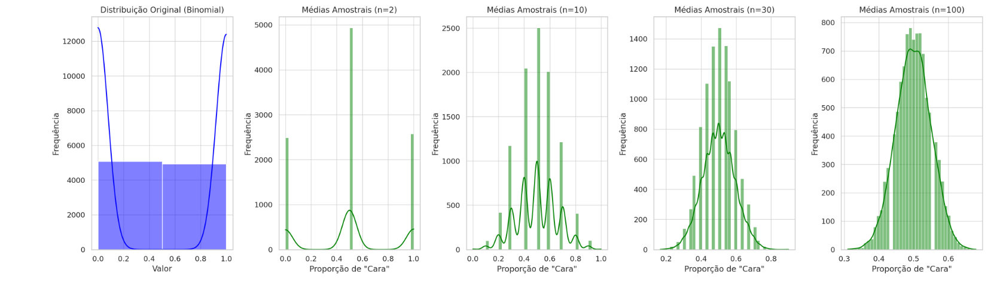

```{r setup, include=FALSE}
knitr::opts_chunk$set(echo = TRUE)
```
--- 

# Objetivo

Neste relatório iremos falar sobre o Teoremo do Limite Central (TLC), no qual afirma que, dada uma amostra suficientemente grande de variáveis aleatórias independentes e identicamente distribuídas (iid), a soma ou a média dessas variáveis tende a seguir uma distribuição normal, independentemente da distribuição original das variáveis. Isso significa que, mesmo que os dados individuais não sigam uma distribuição normal, a distribuição das médias amostrais de dados tende a ser aproximadamente normal, desde que o tamanho da amostra seja grande o suficiente.


# Teorema do Limite Central

Vamos explorar exemplos específicos do Teorema do Limite Central (TLC) com gráficos e explicações de cada cenário. Cada exemplo se refere a diferentes tipos de dados ou situações que ilustram o funcionamento do TLC.

## Conceitos Preliminares

A variável \( Z_n \) é dada por:

\[ Z_n = \frac{\bar{X} - \mu}{\sigma/\sqrt{n}} \overset{n \to \infty}{\longrightarrow} N(0, 1) \]

onde \( \bar{X} = \frac{1}{n} \sum_{i=1}^{n} X_i \), com \( X_i \sim (\mu, \sigma^2) \), sendo independentes e identicamente distribuídos. A esperança de \( \bar{X} \) é igual à média populacional \( \mu \), e sua variância é \( \frac{\sigma^2}{n} \).

Podemos calcular a esperança de \( Z_n \):

\[ E(Z_n) = 0 \]

E a variância de \( Z_n \):

\[ \text{Var}(Z_n) = 1 \]

Logo, \( Z_n \) é uma variável distribuída normalmente com média zero e variância 1.

## Função Característica

A função característica \( \varphi_X(t) \) de uma variável aleatória \( X \) é:

\[ \varphi_X(t) = E[e^{itX}] \]

Ela é única e sempre existe, sendo relacionada aos momentos de \( X \). A função característica de uma soma de variáveis independentes é o produto das funções características de cada variável. Para variáveis independentes \( X_1, X_2, ..., X_n \), temos:

\[ \varphi_{a_1X_1 + a_2X_2 + ... + a_nX_n}(t) = \prod_{i=1}^{n} \varphi_{X_i}(a_i t) \]

## Série de Taylor

Expansão da função característica usando a série de Taylor:

\[ \varphi_Y(t/\sqrt{n}) = 1 - \frac{t^2}{2n} + o(t^2) \]

Quando \( n \to \infty \), obtemos:

\[ \lim_{n \to \infty} \varphi_{Z_n}(t) = e^{-\frac{t^2}{2}} \]

Essa é a função característica de uma variável normal \( N(0, 1) \).

Assim, conforme \( n \to \infinito \), a distribuição da média amostral tende a uma distribuição normal, com a mesma média da população.


## Exemplo 1: Lançamento de Moedas (Distribuição Binomial)

Imagine que você esteja lançando uma moeda honesta (justa) várias vezes e contando quantas "caras" você obteve. A variável "cara" segue uma distribuição binomial, pois temos dois resultados possíveis (cara ou coroa) e podemos calcular a média dos resultados obtidos em várias amostras.

Situação:


- Para cada amostra, você lança a moeda \(n\) vezes e calcula a proporção de "caras".
- Queremos ver o que acontece com a distribuição das proporções de "caras" conforme o tamanho da amostra aumenta.


Explicação Gráfica:
1. A distribuição original dos lançamentos de uma moeda tem dois resultados possíveis: 0 (coroa) e 1 (cara).
2. Ao calcular a média de várias amostras, a distribuição dessas médias se aproxima de uma distribuição normal conforme \(n\) aumenta.





Nos gráficos acima, temos a demonstração do Teorema do Limite Central aplicada ao lançamento de uma moeda (distribuição binomial). Abaixo, explico cada gráfico:


1. Distribuição Original (Binomial): No primeiro gráfico à esquerda, temos a distribuição binomial de 0 (coroa) e 1 (cara), resultante de lançamentos de uma moeda justa. A probabilidade de sair "cara" é 50%, o que resulta em uma distribuição de dois picos, já que só existem dois resultados possíveis.


  2.Médias Amostrais:
  
  
   - Conforme pegamos amostras de diferentes tamanhos (\(n = 2, 10, 30, 100\)), e calculamos a média de cada amostra, observamos que a distribuição das médias amostrais começa a se aproximar de uma distribuição normal.
   - À medida que o tamanho da amostra aumenta, a curva vai ficando mais suavizada e centrada em 0.5, que é a média esperada de "caras" em uma moeda justa.


O Teorema do Limite Central (TLC) é um conceito fundamental na estatística que afirma que, à medida que o tamanho da amostra aumenta, a distribuição das médias amostrais de variáveis aleatórias independentes e identicamente distribuídas (iid) se aproxima de uma distribuição normal, independentemente da distribuição original dessas variáveis.

# Mais exemplos do Teorema do Limite Central

## Exemplo 1: Lançamento de Moedas
Imagine que você esteja lançando uma moeda justa (probabilidade de 50% para cara e 50% para coroa). Esse processo segue uma distribuição binomial, onde os únicos resultados possíveis são "cara" ou "coroa". Se você lançar a moeda várias vezes e calcular a proporção de caras para diferentes tamanhos de amostra, a distribuição dessas proporções se aproximará de uma distribuição normal, conforme o número de lançamentos aumenta.


- Com pequenas amostras (n = 2 ou 3): A proporção de "caras" pode variar muito. No entanto, ao calcular médias para mais lançamentos (por exemplo, \(n = 100\)), essa média tende a se estabilizar perto de 0.5 (que é a média esperada para uma moeda justa).


- Aplicação: Essa ideia é usada em testes de hipóteses sobre proporções, como em pesquisas de opinião pública.

## Exemplo 2: Comprimento de Peixes em um Lago
Estudando o comprimento dos peixes em um lago, e essa característica segue uma distribuição assimétrica, com muitos peixes pequenos e poucos peixes grandes. Ao coletar pequenas amostras (por exemplo, 5 peixes por vez), as médias amostrais podem variar consideravelmente. No entanto, à medida que o tamanho das amostras aumenta (por exemplo, 50 ou 100 peixes por vez), as médias dessas amostras se aproximam de uma distribuição normal, mesmo que a distribuição dos comprimentos individuais não seja normal.

- Com poucas medições: poderiamos obter uma média que não reflete a população inteira devido à assimetria. No entanto, com mais medições, as flutuações são suavizadas, e o efeito do TLC permite que você use ferramentas de análise baseadas na normalidade.

## Exemplo 3: Pontuação em uma Prova
Em uma sala de aula, imagine que os resultados de uma prova sigam uma distribuição multimodal (alguns alunos tiram notas muito baixas, outros muito altas, e o grupo no meio tem notas medianas). Se pegarmos uma pequena amostra de alunos e calcular a média das notas, pode obter uma média que não reflete o grupo inteiro, especialmente se sua amostra incluir apenas alunos de um dos grupos extremos. No entanto, se pegarmos amostras grandes de notas e calcular a média de cada uma, as médias amostrais começam a seguir uma distribuição normal. Isso acontece porque, à medida que tomamos mais alunos na amostra, a variação individual tende a se anular, deixando uma média mais representativa.

- Aplicação: Isso pode ser  utilizado em uma análise de desempenho escolar e na criação de testes padronizados, onde a média das notas deve ser representativa da população total.

## Exemplo 4: Número de Pedidos em um Restaurante
Suponhamos que o número de pedidos recebidos por um restaurante em uma hora siga uma distribuição de Poisson (usada para modelar contagens de eventos). Esse número pode variar consideravelmente de hora para hora, mas se calcularmos a média de pedidos por hora ao longo de um dia inteiro, ou de várias semanas, essa média vai se aproximar de uma distribuição normal.

- Com poucas horas: O número de pedidos pode ser muito variado, com algumas horas muito ocupadas e outras bem tranquilas. No entanto, podemos calcular a média dos pedidos em várias horas ao longo do tempo, a variação se estabiliza e permite uma aproximação normal.

 

# Conclusão

O Teorema do Limite Central é uma ferramenta poderosa que fundamenta a inferência estatística, permitindo a estimativa de parâmetros de populações inteiras pela análise de amostras suficientemente grandes.


